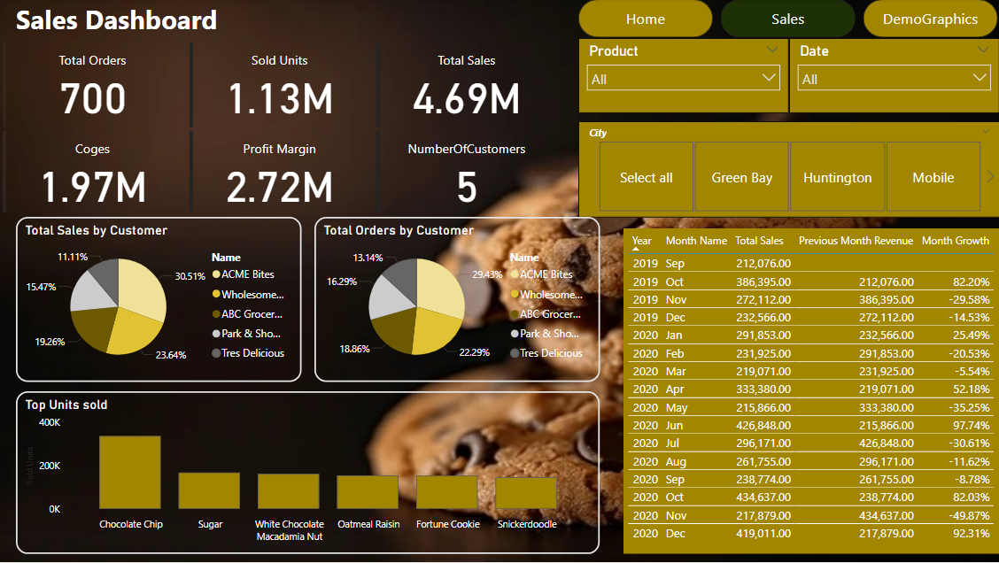
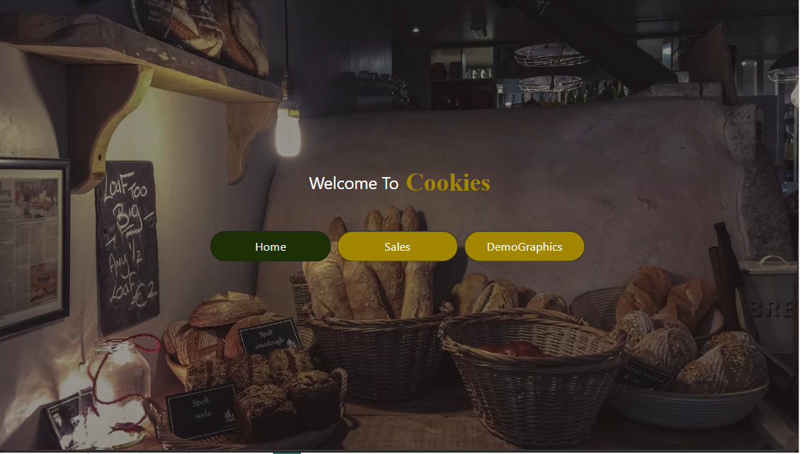
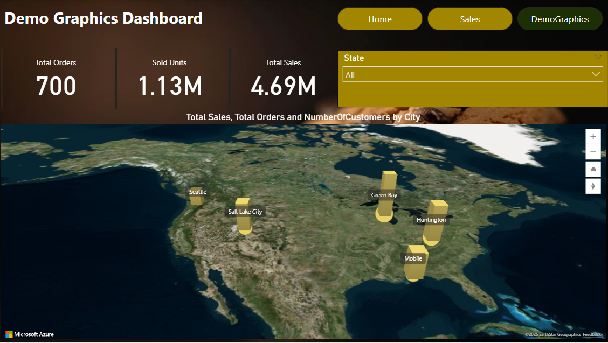

# Cookies-Project
"Interactive Sales Dashboard built with Power BI and DAX. Includes dynamic visuals, time-based comparisons, and advanced business logic for actionable insights
# 📊 Cookies Sales Dashboard – Power BI + DAX

داشبورد تفاعلي لتحليل مبيعات منتج الكوكيز باستخدام Power BI وDAX، مصمم لتقديم رؤى قابلة للتنفيذ من خلال رسوم بيانية ديناميكية وتحليلات زمنية.

## 🛠️ الأدوات المستخدمة
- **Power BI Desktop**
- **DAX (Data Analysis Expressions)**
- **Power Query**
- **Data Modeling**

## 🎯 أهداف المشروع
- تحليل الأداء الشهري للمبيعات
- عرض مؤشرات الأداء الرئيسية (KPIs)
- تمكين المستخدم من التفاعل مع البيانات عبر Slicers وTooltips
- تطبيق منطق بيزنس لتحديد النمو والتراجع

## 📷 معاينة الداشبورد

### نظرة عامة على المبيعات

### الصفحة الرئيسية للداشبورد

### تحليل بياني إضافي

## 👨‍💻 المؤلف
**Mo (Muhammad Emad Ahmed)**  
Data Analyst | Power BI • DAX • SQL  

---

